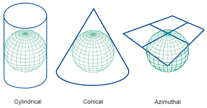

# Introduction
Coordinate systems are essential for accurately representing locations on the Earth's surface and in navigation systems. Various coordinate systems serve different purposes based on their accuracy, ease of use, and applications. This report examines four coordinate systems: UTM (Universal Transverse Mercator), ECEF (Earth-Centered, Earth-Fixed), WGS84 (World Geodetic System 1984), and Gauss-Kruger.

We can categorize them into two categories:
- Geographic coordinate system
- Projected coordinate systems  

## Geographic Coordinate System
A Geographic Coordinate System (GCS) is a coordinate system that enables every location on Earth to be specified by a set of numerical coordinates. These coordinates are typically expressed in terms of latitude, longitude, and sometimes altitude. The GCS uses a three-dimensional spherical surface to define locations on the planet.

- **Latitude (φ)**: Measures the angle between a point and the equatorial plane, ranging from -90° at the South Pole to +90° at the North Pole.
- **Longitude (λ)**: Measures the angle east or west of the Prime Meridian, which runs through Greenwich, England, ranging from -180° to +180°.

## The World Geodetic System 1984 (WGS84)
The World Geodetic System 1984 (WGS84) is a comprehensive global reference system for geospatial data, designed to define precise positions on the Earth's surface. It is predominantly utilized in mapping, navigation, and geodetic applications, providing a standardized coordinate framework for the planet. Developed and introduced in 1984, WGS84 marked a significant advancement in accuracy by integrating satellite data, including information from the Global Positioning System (GPS). Subsequent updates have further refined its precision and broadened its applicability.

WGS84 coordinates are expressed as latitude, longitude, and ellipsoidal height (h).

- **Ellipsoidal Height (h)**: The distance above or below the WGS84 ellipsoid surface. This is the height provided by GPS receivers.
- **Orthometric Height (H)**: The height above the geoid, which approximates mean sea level. This is often derived from ellipsoidal height by applying a geoid model.
- **Geoid Height (N)**: The difference between the ellipsoidal height and orthometric height, representing the separation between the WGS84 ellipsoid and the geoid at a given location.

### The Geoid
The geoid is an equipotential surface of the Earth's gravity field, which corresponds to the mean sea level across the world. It represents a theoretical sea level surface that extends under the continents. The geoid is undulating due to variations in Earth's gravitational field caused by factors like:

- **Mountain Ranges and Ocean Trenches**: Areas with more mass (e.g., mountains) exert a stronger gravitational pull, causing the geoid to bulge upward, whereas areas with less mass (e.g., ocean trenches) cause the geoid to dip.
- **Density Anomalies**: Variations in the density of the Earth's interior (like magma chambers or dense rock formations) cause local gravitational anomalies that affect the geoid's shape.

## ECEF (Earth-Centered, Earth-Fixed)

1. **ECEF is a Cartesian coordinate system that fixes the origin at the Earth's center of mass.** The axes of the system rotate with the Earth, maintaining a fixed orientation relative to the Earth's surface.
   - **X-axis**: Points from the Earth's center to the intersection of the equator and the prime meridian (0° longitude).
   - **Y-axis**: Points from the Earth's center to the intersection of the equator and 90° east longitude.
   - **Z-axis**: Points from the Earth's center to the North Pole.

2. **Applications: ECEF coordinates are used in:**
   - **Satellite Navigation**: Tracking satellite positions relative to the Earth's center.

## Projected Coordinate Systems
A Projected Coordinate System (PCS) is a two-dimensional plane-based system used to represent the three-dimensional surface of the Earth. Unlike a Geographic Coordinate System (GCS), which uses latitude and longitude to define locations on the Earth's curved surface, a PCS converts these locations into a flat, map-like representation through a process called map projection.

### Projection Types:

#### Cylindrical
- Projects the Earth onto a cylinder. Examples include the Mercator and Transverse Mercator projections.
- Preserves angles and shapes for small areas, widely used for nautical purposes.

#### Conic
- Projects the Earth onto a cone. Examples include the Albers Equal-Area and Lambert Conformal Conic projections.
- Preserves shapes, commonly used for aeronautical charts and mid-latitude regions.

#### Azimuthal (Planar)
- Projects the Earth onto a plane. Examples include the Polar Stereographic and Azimuthal Equidistant projections.
- Preserves angles, used for polar regions.

Projected coordinate systems are based on a plane (the spheroid projected on a 2D surface) and utilize linear units such as feet, meters, etc.

## UTM
The Universal Transverse Mercator (UTM) is a global map projection system that divides the world into a series of zones (60 zones), each 6 degrees of longitude wide using a Transverse Mercator projection. This system provides a consistent, high-accuracy means of representing geographic coordinates on a two-dimensional plane.

- Each zone has its own coordinate system, with coordinates measured in meters.
- The central meridian of each zone is assigned a false easting of 500,000 meters to avoid negative coordinates.
- In the Northern Hemisphere, the equator is assigned a false northing of 0 meters; in the Southern Hemisphere, it is 10,000,000 meters to ensure positive coordinates.

## Gauss-Krüger Coordinate System
The Gauss-Krüger coordinate system is a map projection similar to the UTM system but typically used in Europe and parts of Asia. It is a transverse Mercator projection that maps a region of the Earth onto a cylinder, which is then unrolled to form a flat map. However, they have several differences in terms of their implementation, coverage, and usage.

| Aspect              | Gauss-Krüger                  | UTM                                      |
|---------------------|-------------------------------|------------------------------------------|
| Zone Width          | 3 degrees                     | 6 degrees                                |
| Coverage            | National/regional             | Global                                   |
| Coordinate System   | Local Cartesian               | Global Cartesian                         |
| False Easting       | Varies by country/zone        | 500,000 meters                           |
| False Northing      | Varies by country/zone        | 0 m (N. Hemisphere), 10,000,000 m (S. Hemisphere) |
| Applications        | National mapping, cadastre    | International mapping, GPS               |

## references
- [www.linz.govt.nz/guidance/geodetic-system/](https://www.linz.govt.nz/guidance/geodetic-system/coordinate-systems-used-new-zealand/geodetic-datums/world-geodetic-system-1984-wgs84#:~:text=The%20World%20Geodetic%20System%201984,used%20in%20various%20mapping%20applications.)
- [Wikipedia - World Geodetic System](https://en.wikipedia.org/wiki/World_Geodetic_System#WGS_84)
- [Youtube - Intro to coordinate systems and UTM projection](https://www.youtube.com/watch?v=HnWNhyxyUHg&list=LL&index=5&t=699s&ab_channel=MiddleburyRemoteSensing)
- [Youtube - Grid Coordinate Systems and UTM](https://www.youtube.com/watch?v=Q7hWZQTAkRo&list=LL&index=6&t=532s&ab_channel=ArnaldoGagulaYT)